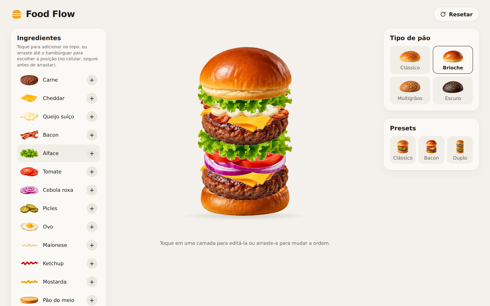
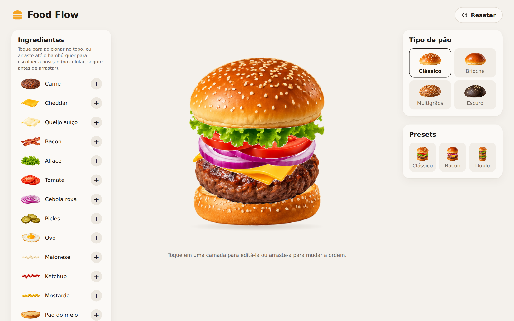
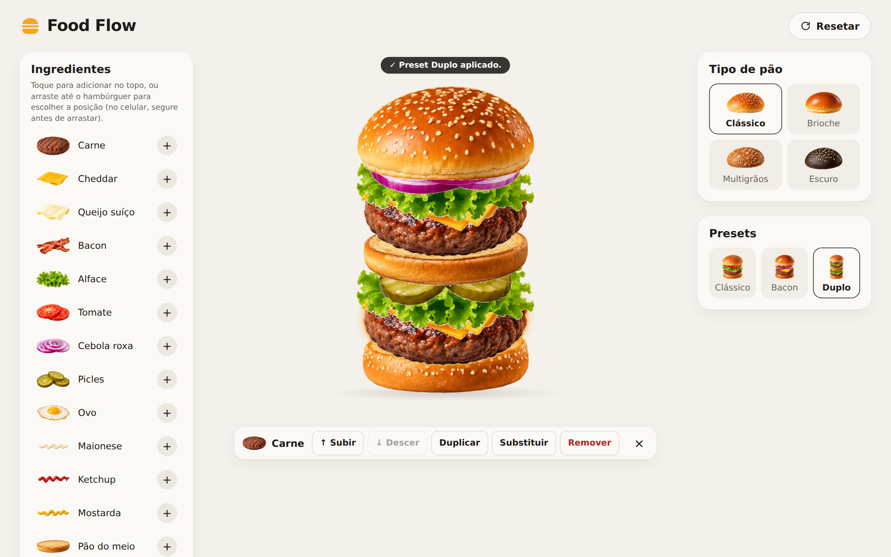
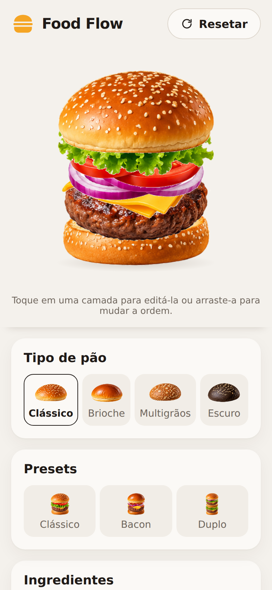
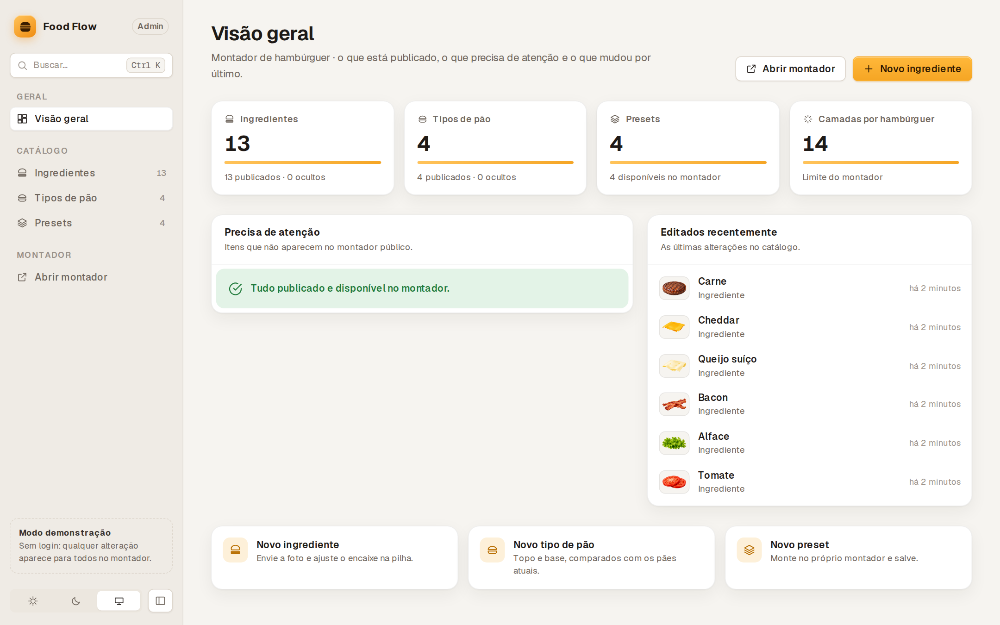
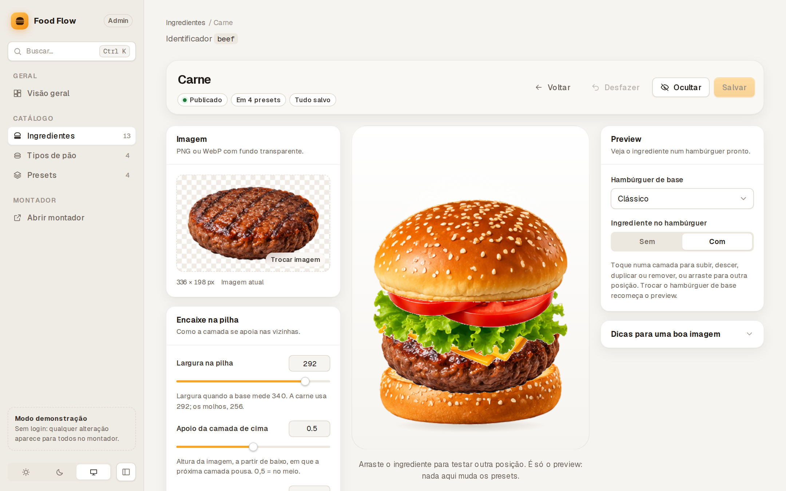
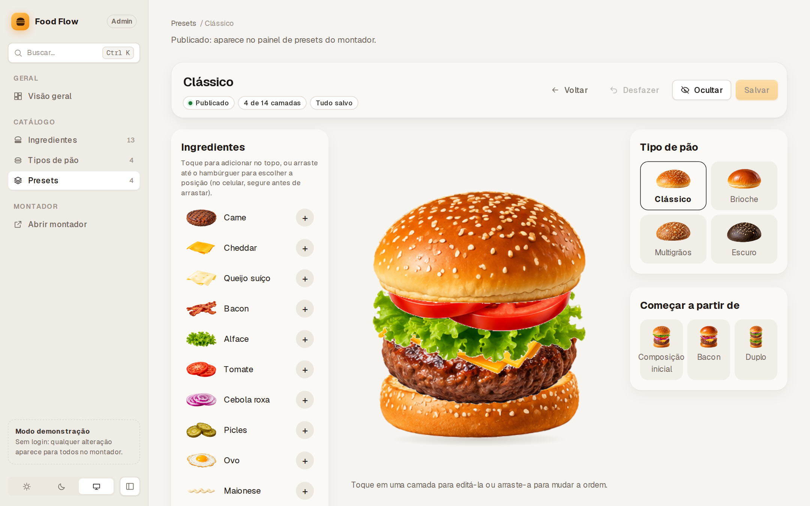

# Food Flow

An interactive builder where you assemble a food item layer by layer, starting with burgers. Pick a bun, stack ingredients, drag them into place, and watch each layer settle into the stack with animation. The catalog is managed through a built-in admin panel and served by a Laravel API.



> The interface text is in Brazilian Portuguese; this README and the code are in English.

## Screenshots

| | |
| --- | --- |
|  |  |
| **Builder.** The default composition: ingredient menu on the left, bun types and presets on the right. | **Layer actions.** Selecting a layer shows move up/down, duplicate, replace and remove. Here the "Duplo" preset was just applied. |

<p align="center">
  
</p>

<p align="center"><b>Mobile.</b> At 390 px the panels stack below the burger.</p>

### Admin

| | |
| --- | --- |
|  |  |
| **Overview.** Catalog counters, items that need attention and recent edits. | **Ingredient studio.** Image upload, stacking measurements and a live preview on a finished burger. |



**Preset editor.** The preset screen embeds the same builder used by customers.

## Features

**Builder (`/`)**

- Four bun types and thirteen ingredients (patty, cheddar, Swiss cheese, bacon, lettuce, tomato, red onion, pickles, egg, mayonnaise, ketchup, mustard, middle bun), loaded from the API.
- Add an ingredient to the top with one tap, or drag it onto the burger to choose its position. On touch screens, press and hold to start dragging.
- Select a layer to move it up or down, duplicate, replace or remove it. Layers can also be reordered by dragging.
- Presets (Clássico, Bacon, Duplo) and a reset button. Switching preset after editing asks for confirmation.
- A layer limit per builder (14 in the seeded data).
- Respects the system "reduced motion" setting and announces changes through status messages.

**Admin (`/admin`)** — no login in this version; it is a demo mode (see [Project status](#project-status)).

- Create, edit, publish/hide and delete ingredients, bun types and presets.
- Image upload with local preview and size/proportion warnings.
- Sliders for how an ingredient sits in the stack, with an interactive preview.
- Search palette (`Ctrl K` / `⌘K`), light/dark/system theme, collapsible sidebar and a layout that adapts from phone to wide screens.

**API**

- Public catalog endpoint plus admin CRUD endpoints, with validation, rate limiting and protection for in-use items (for example, an ingredient used by a preset cannot be deleted).

## Tech stack

| Area | Technology | Role |
| --- | --- | --- |
| Frontend | Next.js 16 (App Router), React 19, TypeScript | Builder and admin; catalog is fetched on the server |
| Animation | [Motion](https://motion.dev) (`motion/react`) | Spring animations for layers, enter/exit and bun settling |
| Backend | Laravel 13, PHP 8.4 | REST API, validation, image storage |
| Database | MySQL 8.4 | Catalog data (images are stored on disk, paths in the database) |
| Tooling | pnpm workspaces, Kool + Docker, ESLint, Vitest, PHPUnit, Laravel Pint | Monorepo, containers, tests and formatting |

## Getting started

### Prerequisites

- Node.js 24+
- pnpm 12 (`corepack enable`)
- Docker and [Kool](https://kool.dev) — PHP, Composer and MySQL run only in containers

The project is developed on WSL2 (Ubuntu) with the repository on the Linux filesystem. On Windows, avoid running it from `/mnt/c/...`.

### First run

```bash
git clone git@github.com:JoaoOliveira20/food-flow.git
cd food-flow
pnpm install

cd apps/api
kool run setup        # creates .env, starts containers, installs Composer deps,
                      # generates the key, links storage and runs migrations

cd ../web
cp .env.example .env.local   # API_URL / NEXT_PUBLIC_API_URL (default http://localhost:8000)
```

### Day to day

```bash
pnpm dev:api          # API + MySQL in the background → http://localhost:8000 (health: /up)
pnpm dev              # frontend → http://localhost:3000
```

- Builder: http://localhost:3000
- Admin: http://localhost:3000/admin

Stop with `Ctrl+C` for the frontend and `pnpm stop:api` for the containers. Data is kept in a Docker volume. If the API is down, the builder shows an error with a retry button.

If you need the initial catalog back, run `kool run reset` inside `apps/api` (this deletes uploaded images and recreates the database from the seed).

### Scripts

From the repository root:

```bash
pnpm build            # production build of the web app
pnpm lint             # ESLint in all packages
pnpm typecheck        # type checking in all packages
pnpm test             # Vitest (web)
pnpm test:api         # PHPUnit (API, runs in the containers)
```

## Project structure

```text
apps/
  web/                 Next.js app: builder (/) and admin (/admin)
    src/burger/          pure logic: catalog types, composition state, stack layout, drag geometry
    src/components/      builder and admin UI
    src/api/             API client (server reads, browser writes)
    src/hooks/           drag, element size, media query helpers
  api/                 Laravel API (runs only in containers, outside the pnpm workspace)
    app/                 controllers, models, image storage
    database/seeders/    initial burger catalog and source images
    tests/               PHPUnit feature tests
experiments/           Motion, GSAP and React Spring prototypes used to pick the animation library
docs/                  decisions, architecture, data model, task log and screenshots
```

## Technical notes

- **Single source of truth.** The composition state (`src/burger/composition.ts`) is a pure reducer. The layout is derived from it and animations only move each layer to the derived position; no visual position is stored separately.
- **Stack layout from the catalog.** `computeStackLayout` places each layer using three values stored per ingredient: display width, where the next layer rests on its image (`restingSurfaceRatio`) and how much it sinks into the layer below (`sinkRatio`). Heights come from the PNG proportions, so a new ingredient needs no code, only an image and these measurements.
- **Animation with Motion.** Layer motion parameters live in `layerMotion.ts`. `AnimatePresence` keeps removed layers until their exit finishes, stable instance ids keep duplicates independent, and no action waits for an animation to end. `y` is animated from the computed layout instead of Motion's `layout` prop because layers overlap by calculation inside a scaled container.
- **Drag and drop with Pointer Events.** A hook decides what is being dragged and where it would be inserted; the builder renders a preview composition, so neighbours simply animate to make room.
- **Data flow.** Catalog reads happen on the Next.js server; admin writes go from the browser straight to the API, followed by a refresh.
- **Why Motion.** The three experiments in `experiments/` were compared before choosing; the reasoning is in `docs/LIBRARY_DECISION.md`.

More detail: `apps/web/README.md` (frontend architecture), `apps/api/README.md` (endpoints and errors), `docs/ARCHITECTURE.md`, `docs/DATA_MODEL.md` and `docs/BACKEND_DECISIONS.md`.

## Project status

The builder, the admin and the API are implemented and working together. Automated checks cover the pure frontend logic (Vitest) and the API (PHPUnit); the UI and animations were verified manually, with no tests on physical devices or with users.

Known limitations and open items:

- The admin has **no authentication**; do not expose it publicly as is.
- Images are stored on the local disk; an external storage disk is planned but not implemented.
- Burgers are the only builder so far. The data model supports multiple builders, but a second one (for example, pizza) has not been built.
- Ingredient stacking values were tuned visually, without automatic measurement of the images.

The task log with planned improvements is in `docs/TASKS.md`.

## License

No license file has been added to this repository yet, so all rights are reserved by default.
